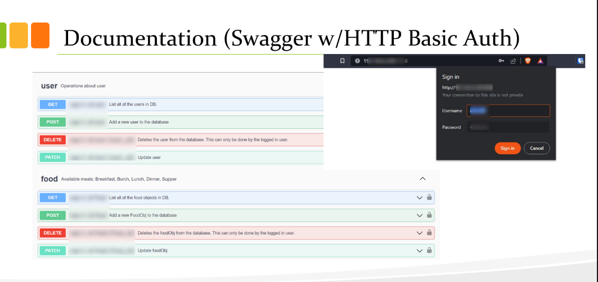
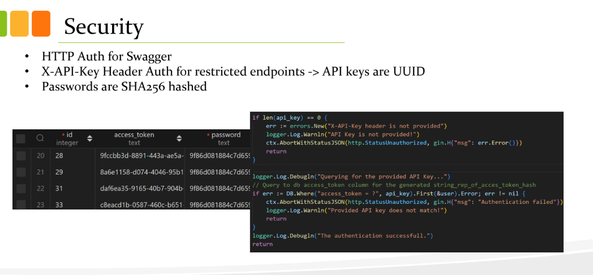

# backend_main_api

It's an API side of a TUBITAK-2209A project developed by Resul Bozburun. It is a part of a AI Based Mobile Application Project (Fitness & Health App)

**The project is archieved, not maintained.**

## Services
- Predict AI: http://<REDACTED>:4848/predict/
- Swagger API Documentation URL: http://<hostname>:8088/
- API Root URL: http://<hostname>:7854/api/1.0/<endpoint>
- Log Viewer: http://<hostname>:880/logs

## Usage
To reach API documentation page, HTTP Basic Auth is necessary. You can find the credentials in below.
- **User:** calcul48
- **Pawssord:** Eat.48!App

## Slides
You can access the whole slides about the project with [this Drive link.](https://drive.google.com/file/d/1brSFYLhZO1UswA9eKQHdlFGTIc3hsPxo/view) 

